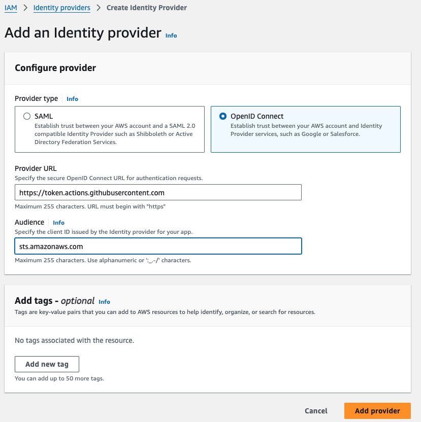
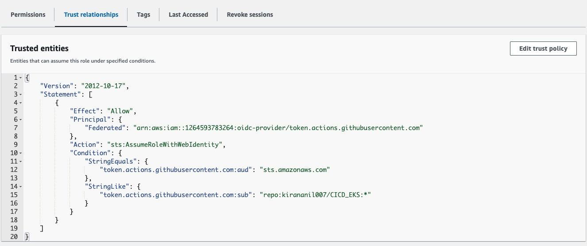

# AWS EKS Cluster Creation with GitHub Actions and OIDC  

  
  

### Description

This repository demonstrates how to securely create an Amazon EKS cluster using GitHub Actions and OpenID Connect (OIDC) for authentication with AWS. By leveraging OIDC, we eliminate the need to manage and rotate long-term AWS credentials, enhancing both security and simplicity.  

### Features

- **GitHub Actions**: Automated CI/CD workflow for EKS provisioning.  
- **OIDC Integration**: Secure AWS authentication without access keys.  
- **Scalability**: Fully configurable for your specific use case.  

### Prerequisites

- AWS account with EKS permissions.  
- GitHub repository with OIDC configured. [Guide here](https://docs.github.com/en/actions/deployment/security-hardening-your-deployments/about-security-hardening-with-openid-connect).  

### Setup and Usage
1. **Configure OIDC** in your AWS account:  
   - Create an IAM role with required permissions.  
   - Set up a trust relationship with GitHub Actions.  

2. **Fork this repository** and update `eks-cluster.yml`:  
   ```yaml
   aws-region: "your-region"
   cluster-name: "your-cluster-name"

3. **Trigger the workflow**: Push to the main branch or manually trigger the action.

### Configure GitHub OIDC with AWS

1. **Enable OIDC on GitHub**  
   - GitHub Actions natively supports OIDC. No additional setup is required on GitHub. For more info, please refer [this](https://docs.github.com/en/actions/security-for-github-actions/security-hardening-your-deployments/configuring-openid-connect-in-amazon-web-services).

2. **Set Up an OIDC Identity Provider in AWS** 

   
   - Go to the IAM service in the AWS Management Console.  
   - Add an **Identity Provider**:  
     - **Type**: OpenID Connect  
     - **URL**: `https://token.actions.githubusercontent.com`  
     - **Audience**: `sts.amazonaws.com`  

3. **Create an IAM Role for GitHub Actions**  

      
   
   - Go to **IAM > Roles** and create a new role:  
     - **Trusted Entity**: Select the OIDC provider you created.  
     - **Conditions**: (Optional) Restrict access to specific repositories and branches:  
       ```json
       {
         "StringEquals": {
           "token.actions.githubusercontent.com:sub": "repo:<your-username>/<your-repo>:ref:refs/heads/<branch-name>"
         }
       }
       ```  
     - Attach necessary policies like `AmazonEKSClusterPolicy` or a custom policy.  

4. **Update GitHub Actions Workflow**  
   - Add the following to your workflow file:  
     ```yaml
     permissions:
       id-token: write
       contents: read

     - name: Configure AWS Credentials
       uses: aws-actions/configure-aws-credentials@v3
       with:
         role-to-assume: arn:aws:iam::<account-id>:role/<role-name>
         aws-region: <your-region>
     ```  

5. **Test the Configuration**  
   - Run the workflow to verify successful role assumption and AWS access.


### Highlights  
- **Why OIDC?**  
   - **No access keys**: Directly use GitHub's identity tokens.  
   - **Improved security**: Short-lived credentials reduce attack surface.  
   - **Simplicity**: No need for manual credential management.  

- **EKS Advantages**:  
   - Fully managed Kubernetes clusters.  
   - Seamless integration with AWS ecosystem.  

